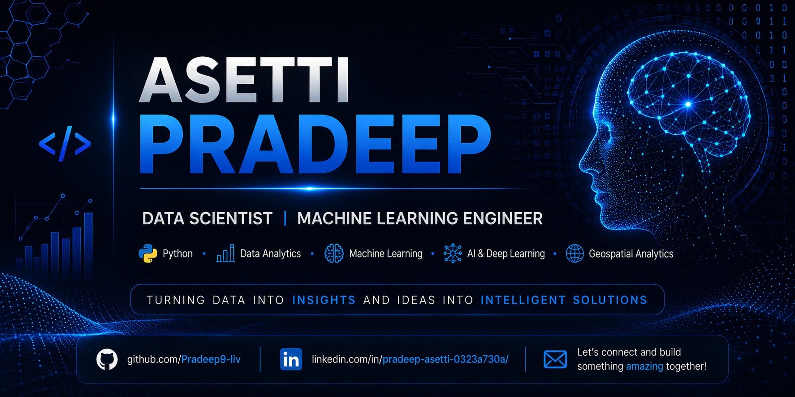

<!-- ============================= -->
<!--      GitHub Profile README    -->
<!-- ============================= -->

<p align="center">
  
</p>

<h1 align="center">Hi 👋, I'm Asetti Pradeep</h1>

<p align="center">
  
</p>

<p align="center">
  <a href="https://github.com/Pradeep9-liv">
    
  </a>

  <a href="https://linkedin.com/in/pradeep-asetti-0323a730a/">
    
  </a>

  <a href="mailto:YOUR_EMAIL@gmail.com">
    
  </a>
</p>

<p align="center">
  
</p>

---

# 👨‍💻 About Me

I'm **Asetti Pradeep**, an aspiring **Data Scientist** passionate about building intelligent solutions using **Machine Learning**, **Artificial Intelligence**, and **Data Analytics**.

I enjoy transforming raw data into actionable insights, developing predictive models, and creating end-to-end AI applications.

My areas of interest include:

- 🤖 Machine Learning
- 📊 Data Analytics
- 🧠 Generative AI
- 📄 Retrieval-Augmented Generation (RAG)
- 🗺️ Geospatial Analytics
- 📈 Predictive Modeling

Currently expanding my knowledge in **Deep Learning**, **MLOps**, **AI Agents**, and **Large Language Models (LLMs)**.

---

# 🛠️ Tech Stack

### Languages & Tools

<p align="center">

</p>

### Data Science

<p align="center">


</p>

### AI & LLM

<p align="center">


</p>

---

# 🚀 Featured Projects
| Project | Description |
|---------|-------------|
| 🏥 **[Hospital Length of Stay Prediction](https://github.com/GarlicDeveloper/curatech)** | Machine Learning model for predicting patient hospital stay duration. |
| 🗺️ **[NYC Geospatial Business Analytics](https://github.com/Pradeep9-liv/NYC-Geospatial-Business-Recommendation)** | Interactive geospatial analysis using Folium. |

---

# 🔥 GitHub Streak

<p align="center">


</p>

---

# 🌱 Currently Learning

- 🧠 Deep Learning
- 🤖 Large Language Models (LLMs)
- ⚙️ MLOps
- 🚀 AI Agents
- 🗺️ Geospatial Analytics

---

# 🎯 2026 Goals

- ✅ Build production-ready AI applications
- ✅ Contribute to Open Source
- ✅ Deploy scalable ML projects
- ✅ Master MLOps

---

# 📫 Connect With Me

<p align="center">

<a href="https://github.com/Pradeep9-liv">GitHub</a> •
<a href="https://linkedin.com/in/pradeep-asetti-0323a730a/">LinkedIn</a> •
<a href="mailto:pradeepasetti789@gmail.com">Email</a>

</p>

---

# 💬 Quote

> **"Turning data into insights and ideas into intelligent solutions."**

---

<p align="center">
⭐ Thanks for visiting my profile! ⭐
</p>
```
